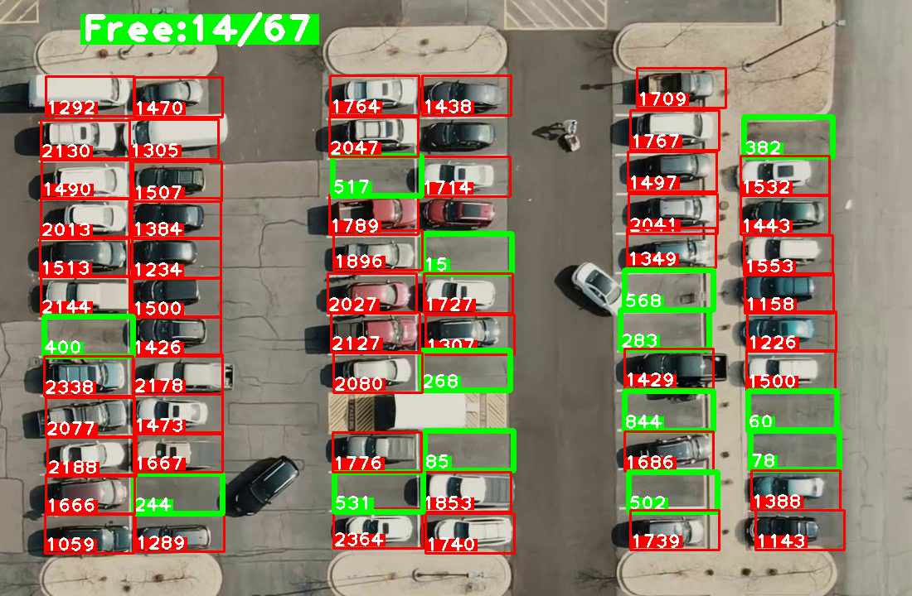

# 🚗 Parking Space Detection using OpenCV



This project detects **parking spaces** in a parking lot using **OpenCV, Python, and image processing techniques**. It includes:
- A tool to **select parking spaces (`posList`)**.
- A script to **process video and detect available spaces**.

## 📁 Project Structure
├── main.py # Main script for detecting parking availability

├── parking_space_picker.py # GUI tool to select and store parking positions

├── CarParkPos # Pickle file storing selected parking positions 

├── carPark.mp4 # Input video for parking lot analysis

├── carParkImg.png # Image used for parking spot selection 

├── output.mp4 # Processed video with detected spaces 

├── README.md # Project documentation

## 🛠 Installation & Setup

### 1️⃣ Install Dependencies
Ensure you have Python installed. Then, install required packages:
```
pip install opencv-python numpy cvzone
```
2️⃣ Select Parking Spots
Run parking_space_picker.py to mark parking spaces:
```
python parking_space_picker.py
```
Left Click 🖱️ → Add a parking space

Right Click 🖱️ → Remove a parking space

Spots are saved automatically in CarParkPos.

3️⃣ Run Parking Detection
After marking spots, run main.py to detect available spaces:
```
python main.py
```
Processes carPark.mp4 and overlays free (🟩) / occupied (🟥) spaces.

Saves annotated output as output.mp4.

### ⚙️ How It Works
```
Position Selection (parking_space_picker.py)

Loads a static image (carParkImg.png).

Allows user to manually select parking spots.

Stores positions in CarParkPos using Pickle.

Parking Detection (main.py)

Reads the video feed (carPark.mp4).

Converts frames to grayscale, applies thresholding & dilation.

Counts non-zero pixels in marked spots to determine availability.

Displays live output with parking status.
```

### 🎯 Expected Output


✅ Real-time display of parking availability.


✅ Saved video (output.mp4) with detected spaces.


Example: Green 🟩 = Free, Red 🟥 = Occupied

### 🚀 Potential Improvements


🔹 Live Camera Feed instead of a pre-recorded video.


🔹 Deep Learning (YOLO, CNNs) for more accurate detection.


🔹 Web Interface using Flask/FastAPI for remote monitoring.
